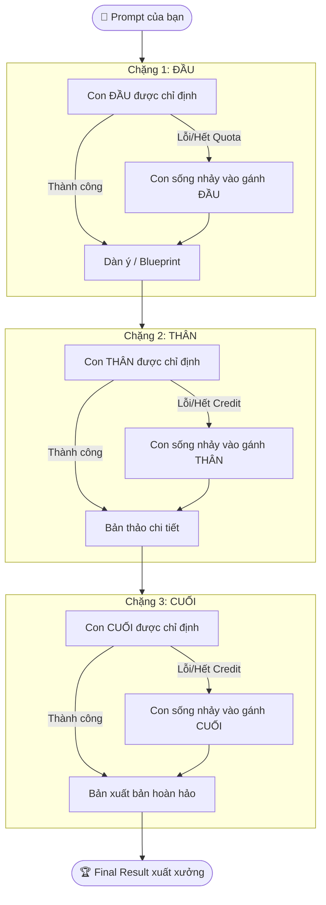

# Phase 10: Resilient 3-Stage Pipeline (Dây Chuyền 3 Chặng ĐẦU ➔ THÂN ➔ CUỐI Tự Phục Hồi)

## 1. Mục tiêu (Objective)

Thiết kế dây chuyền tự động hóa 3 chặng chuyên trách:
1. **Chặng 1 (ĐẦU)**: Lập Blueprint / Dàn ý / Phân tích yêu cầu.
2. **Chặng 2 (THÂN)**: Triển khai nội dung cốt lõi / Sinh mã nguồn chi tiết.
3. **Chặng 3 (CUỐI)**: Thẩm định chất lượng, rà soát bug, tối ưu & trau chuốt.

### 🌟 Nguyên tắc Sống Còn: "Con nào chết thì con còn sống nhảy vào!" (Active-Survivor Failover)
- Bất kể người dùng gán con nào cho ĐẦU, THÂN, CUỐI (kể cả gán con đang hết credit/quota):
- **Nếu một con bị chết (429 Quota, 400 Balance, 503 Overload, Network Timeout)**:
  ➔ Hệ thống ngay lập tức bắt lỗi độc lập.
  ➔ Tự động xác định các con AI đang **"CÒN SỐNG"** (Active Providers).
  ➔ Chuyển giao dữ liệu của chặng đó cho con còn sống **NHẢY VÀO THAY THẾ NGAY LẬP TỨC**!
  ➔ Dây chuyền không bao giờ bị đứt đoạn, người dùng luôn luôn nhận được kết quả hoàn hảo!

---

## 2. Kiến trúc Tự Phục Hồi (Failover Architecture)



---

## 3. Cấu hình Mặc định & Lưu Trữ (`config/pipeline_stages.json`)

```json
{
  "head": {
    "provider": "groq",
    "model": "openai/gpt-oss-120b",
    "role": "Planner & Architect",
    "prompt_template": "Bạn là Software Architect. Hãy phân tích yêu cầu sau và lập dàn ý kiến trúc kỹ thuật từng bước chuẩn xác:\n{input}"
  },
  "body": {
    "provider": "gemini",
    "model": "gemini-3.1-flash-lite",
    "role": "Core Implementer",
    "prompt_template": "Dựa trên dàn ý kiến trúc Chặng 1 sau:\n{previous_output}\n\nvà yêu cầu gốc: '{input}', hãy viết mã nguồn/nội dung giải pháp hoàn chỉnh, chuẩn công nghiệp, chi tiết và có chú thích rõ ràng."
  },
  "tail": {
    "provider": "groq",
    "model": "openai/gpt-oss-120b",
    "role": "Auditor & Polisher",
    "prompt_template": "Bạn là Senior Code Reviewer & Quality Auditor. Hãy đọc bản thảo Chặng 2 sau:\n{previous_output}\n\n1. Kiểm tra rà soát lỗi logic, lỗ hổng bảo mật, bắt các edge cases.\n2. Tối ưu hiệu năng và trau chuốt xuất bản phiên bản hoàn hảo nhất."
  }
}
```

---

## 4. Trải nghiệm Người Dùng (CLI UX Flow)

```text
===========================================================================
  ⛓️ DÂY CHUYỀN 3 CHẶNG (ĐẦU ➔ THÂN ➔ CUỐI)
  [ĐẦU: Groq] ➔ [THÂN: OpenAI (gpt-4o)] ➔ [CUỐI: Claude]
  Cơ chế: "Con nào chết thì con còn sống nhảy vào gánh!"
===========================================================================
👉 Nhập yêu cầu của bạn: Viết thuật toán Rate Limiter Token Bucket

  [1/3] 🟢 ĐẦU (Groq - gpt-oss-120b)     : Đang lập dàn ý kiến trúc... [XONG - 0.9s]
  [2/3] 🟡 THÂN (OpenAI - gpt-4o)        : ⚠️ Gặp lỗi: 429 Quota $0.
        🚨 FAILOVER: Gemini (gemini-3.1-flash-lite) NHẢY VÀO GÁNH THÂN... [XONG - 2.8s]
  [3/3] 🔵 CUỐI (Claude)                 : ⚠️ Gặp lỗi: 400 Balance $0.
        🚨 FAILOVER: Groq (gpt-oss-120b) NHẢY VÀO GÁNH CUỐI... [XONG - 1.1s]

===========================================================================
🏆 KẾT QUẢ CUỐI CÙNG (Dây chuyền hoàn tất tự động - Tổng thời gian: 4.8s)
===========================================================================
[Nội dung hoàn hảo, đã qua đủ 3 chặng Blueprint ➔ Implement ➔ Audit]
```
