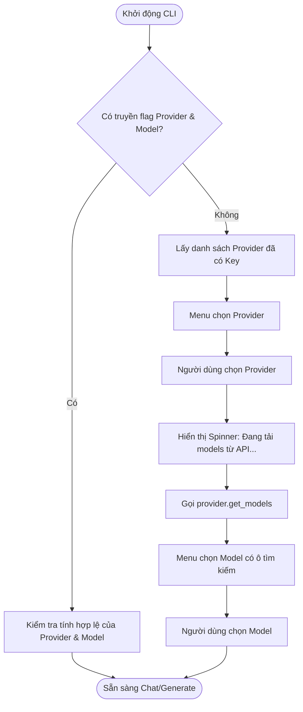

# Phase 4: CLI Chọn Provider -> Model

## 1. Mục tiêu (Objective)
Xây dựng giao diện dòng lệnh (CLI) tương tác mượt mà, trực quan, cho phép người dùng:
1. Nhìn thấy các Provider nào đang khả dụng (đã cấu hình API Key).
2. Chọn Provider mong muốn.
3. Hệ thống tự động fetch danh sách model động từ Provider đó và hiển thị danh sách `ModelInfo` đã được chuẩn hóa.
4. Cho phép tìm kiếm / lọc nhanh model (fuzzy search).
5. Hỗ trợ cả 2 chế độ: Tương tác (Interactive Prompt) và Tham số dòng lệnh (Direct CLI flags).

---

## 2. Thư viện đề xuất
- **`rich`**: Hiển thị bảng màu, console log đẹp mắt, spinner khi đang fetch model từ API.
- **`questionary`** hoặc **`inquirerpy`**: Cung cấp menu chọn bằng phím mũi tên, filter/search text theo thời gian thực.
- **`argparse`** hoặc **`click`** / **`typer`**: Xử lý tham số truyền vào từ terminal.

```bash
pip install rich questionary
```

---

## 3. Luồng hoạt động (User Flow)



---

## 4. Thiết kế mã nguồn (Reference Implementation)

```python
# cli/selector.py
from typing import Optional, Tuple
from rich.console import Console
from rich.panel import Panel
import questionary

from config import AppConfig
from providers.base import BaseProvider
from models.model_info import ModelInfo

console = Console()

class CLISelector:
    def __init__(self, config: AppConfig, provider_map: dict[str, BaseProvider]):
        self.config = config
        self.provider_map = provider_map

    def select_provider(self) -> Optional[str]:
        """Cho phép người dùng chọn Provider đã cấu hình API Key."""
        available = self.config.get_available_providers()
        if not available:
            console.print("[bold red]Lỗi:[/bold red] Chưa có API Key nào được thiết lập trong .env!")
            console.print("Vui lòng cấu hình ít nhất một trong: OPENAI_API_KEY, GEMINI_API_KEY, ANTHROPIC_API_KEY")
            return None

        # Format các lựa chọn
        choices = [
            questionary.Choice(
                title=f"{p.upper()} (Đã sẵn sàng)",
                value=p
            )
            for p in available
        ]

        provider = questionary.select(
            "Chọn AI Provider:",
            choices=choices,
            style=questionary.Style([
                ("selected", "fg:green bold"),
                ("pointer", "fg:green bold")
            ])
        ).ask()

        return provider

    def select_model(self, provider_name: str) -> Optional[ModelInfo]:
        """Tải danh sách model động từ provider và cho phép người dùng chọn."""
        provider = self.provider_map.get(provider_name)
        if not provider:
            console.print(f"[red]Provider '{provider_name}' không tồn tại.[/red]")
            return None

        with console.status(f"[bold cyan]Đang lấy danh sách models từ {provider_name.upper()} API...[/bold cyan]", spinner="dots"):
            try:
                models = provider.get_models()
            except Exception as e:
                console.print(f"[bold red]Lỗi khi gọi API của {provider_name}:[/bold red] {e}")
                return None

        if not models:
            console.print(f"[yellow]Không tìm thấy model nào khả dụng cho {provider_name}.[/yellow]")
            return None

        # Tạo danh sách choice với nhãn và mô tả
        choices = [
            questionary.Choice(
                title=m.full_label,
                value=m
            )
            for m in models
        ]

        selected_model: ModelInfo = questionary.select(
            f"Chọn model của {provider_name.upper()} (Dùng phím mũi tên hoặc gõ để tìm):",
            choices=choices,
            use_search_filter=True
        ).ask()

        return selected_model

    def run_interactive(self) -> Optional[Tuple[BaseProvider, ModelInfo]]:
        """Chạy toàn bộ luồng tương tác: Chọn Provider -> Chọn Model."""
        console.print(Panel.fit("[bold green]MULTI-AI PYTHON TOOL[/bold green]\nCông cụ dòng lệnh tương tác đa mô hình AI", border_style="cyan"))
        
        provider_name = self.select_provider()
        if not provider_name:
            return None

        model_info = self.select_model(provider_name)
        if not model_info:
            return None

        console.print(f"\n[green]✓[/green] Đã chọn: [bold cyan]{model_info.display_name}[/bold cyan] ({model_info.id}) trên [bold magenta]{provider_name.upper()}[/bold magenta]")
        if model_info.input_token_limit:
            console.print(f"  Context limit: [yellow]{model_info.input_token_limit:,} tokens[/yellow]")

        return self.provider_map[provider_name], model_info
```

---

## 5. Hỗ trợ Direct CLI Arguments (Non-interactive)
Ngoài chế độ menu, công cụ hỗ trợ truyền trực tiếp:
```bash
# Ví dụ chạy nhanh không cần qua menu:
python main.py --provider gemini --model gemini-2.5-flash --prompt "Giải thích nguyên lý hoạt động của Transformer"
```

---

## 6. Tiêu chí hoàn thành (Definition of Done)
- [ ] Giao diện CLI hiển thị spinner khi đang tải models qua mạng.
- [ ] Menu tương tác chỉ liệt kê các provider đã có API Key.
- [ ] Chức năng tìm kiếm nhanh model theo tên hoặc ID hoạt động mượt mà.
- [ ] Xử lý thông báo lỗi chi tiết nếu mất kết nối mạng hoặc key hết hạn khi load models.
- [ ] Trả về đúng đối tượng `(provider_instance, model_info)` cho các phase tiếp theo.
