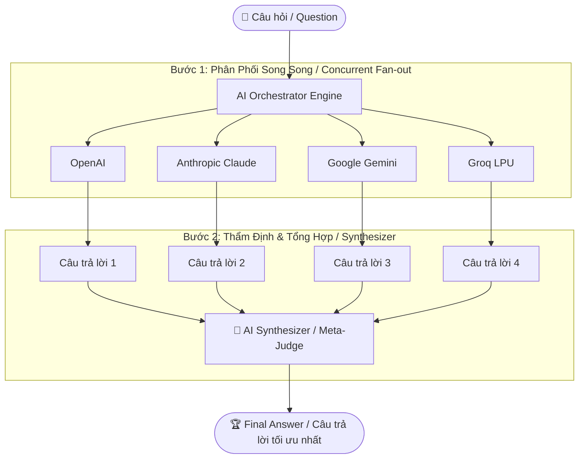

# Phase 8: Multi-Model Orchestration & Synthesis

## 1. Kiến trúc Tổng thể (Overall Architecture)

Mô hình điều phối và tổng hợp trí tuệ đa mô hình (Multi-Model Orchestration & Synthesis) giải quyết nhược điểm của việc chỉ tin cậy vào một mô hình duy nhất bằng cách khai thác sức mạnh tập thể của nhiều LLM hàng đầu:



---

## 2. Quy trình Xử lý 3 Giai đoạn (3-Stage Workflow)

### Giai đoạn 1: Phân phối Đa luồng (Parallel Fan-out)
- Sử dụng `concurrent.futures.ThreadPoolExecutor` gửi câu hỏi đồng thời tới tất cả các Provider đã cấu hình API Key.
- Thu thập câu trả lời độc lập, không làm ảnh hưởng lẫn nhau:
  - Nếu một provider lỗi (như hết quota hoặc mạng chậm), các provider khác vẫn tiếp tục bình thường.
  - Ghi nhận đầy đủ: Nội dung trả lời, thời gian phản hồi (latency `ms`), lượng token tiêu thụ.

### Giai đoạn 2: Bộ Tổng hợp Phân tích (AI Synthesizer / Meta-Judge)
- Một model đảm nhận vai trò **Synthesizer** (mặc định sử dụng model mạnh nhất đang khả dụng, ví dụ: `gemini-3.1-flash-lite` hoặc `openai/gpt-oss-120b` của Groq).
- Synthesizer được cung cấp:
  1. Câu hỏi gốc của người dùng.
  2. Toàn bộ các câu trả lời độc lập từ từng AI (kèm tên AI cụ thể).
  3. Prompt chỉ dẫn thẩm định nghiêm ngặt:
     - **Điểm đồng thuận**: Những thông tin chuẩn xác mà tất cả các AI đều thống nhất.
     - **Góc nhìn bổ sung**: Những điểm hay, sâu sắc riêng mà từng AI đóng góp.
     - **Phát hiện sai lệch (nếu có)**: Loại bỏ các thông tin bị ảo giác (hallucination) hoặc mâu thuẫn.
     - **CÂU TRẢ LỜI CUỐI CÙNG (Final Answer)**: Bản tổng hợp hoàn chỉnh, chính xác, sâu sắc và khách quan nhất.

### Giai đoạn 3: Trình bày Trực quan (Presentation & Inspection)
- Người dùng nhận ngay **Final Answer** được định dạng rõ ràng, chuyên nghiệp.
- Cho phép người dùng tùy chọn xem chi tiết câu trả lời gốc của từng AI để đối chiếu độc lập.

---

## 3. Thiết kế Cấu trúc Dữ liệu (Data Models)

### `ProviderExecutionResult`
```python
@dataclass
class ProviderExecutionResult:
    provider: str
    model: str
    success: bool
    response: Optional[UnifiedResponse] = None
    error_message: Optional[str] = None
    latency_ms: float = 0.0
```

### `SynthesizerResult`
```python
@dataclass
class SynthesizerResult:
    prompt: str                                       # Câu hỏi gốc
    individual_results: List[ProviderExecutionResult] # Kết quả từ từng AI
    synthesizer_provider: str                         # Provider làm nhiệm vụ tổng hợp
    synthesizer_model: str                            # Model làm nhiệm vụ tổng hợp
    final_answer: str                                 # Câu trả lời tổng hợp cuối cùng
    total_latency_ms: float                           # Tổng thời gian xử lý toàn quy trình
    successful_providers: List[str]                   # Danh sách các AI đã đóng góp
```

---

## 4. Trải nghiệm Người Dùng (CLI UX Design)

```text
===========================================================================
  🧠 MULTI-MODEL ORCHESTRATION & SYNTHESIS
===========================================================================
[?] Câu hỏi: So sánh ưu nhược điểm giữa Microservices và Monolithic?

[+] BƯỚC 1: Đang gửi câu hỏi đồng thời tới các AI...
    ⏳ Groq LPU (gpt-oss-120b)     : [HOÀN TẤT] (820 ms)
    ⏳ Google Gemini (flash-lite)  : [HOÀN TẤT] (2,400 ms)
    ⏳ OpenAI                      : [BỎ QUA - Quota $0]
    ⏳ Anthropic                   : [BỎ QUA - Quota $0]

[+] BƯỚC 2: AI Synthesizer đang phân tích và tổng hợp câu trả lời tối ưu...
    ⏳ Đang xử lý qua Synthesizer (Gemini)... [HOÀN TẤT] (1,950 ms)

===========================================================================
🏆 FINAL ANSWER (CÂU TRẢ LỜI TỔNG HỢP TỐI ƯU NHẤT)
Tổng hợp từ: GROQ, GEMINI | Tổng thời gian: 4.3s
===========================================================================
[Nội dung tổng hợp hoàn chỉnh, kết hợp góc nhìn kiến trúc sâu sắc nhất...]

---------------------------------------------------------------------------
[?] Tùy chọn: Nhấn [1] để xem chi tiết câu trả lời từng AI | [Enter] tiếp tục
```
