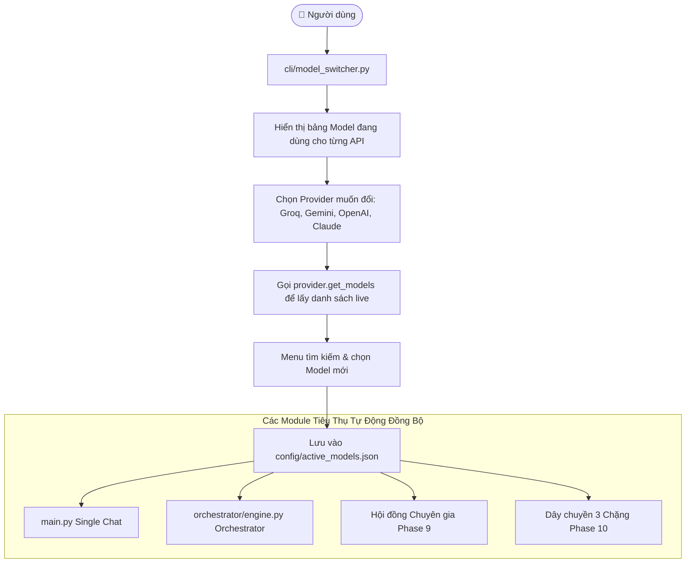

# Phase 9.1: Per-API Model Switcher (Quản Lý & Chuyển Đổi Model Cho Từng Provider)

## 1. Mục tiêu (Objective)

Cho phép người dùng chủ động kiểm tra và **chuyển đổi (switch) model đang hoạt động** cho từng API/Provider riêng biệt (Groq, Google Gemini, OpenAI, Anthropic Claude):
1. **Quản lý tập trung**: Xem nhanh mô hình nào đang được kích hoạt làm mặc định cho từng API.
2. **Khám phá & Chọn động (Live Model Discovery)**: Khi muốn đổi model cho một API, hệ thống tự động gọi `provider.get_models()` để hiển thị danh sách mới nhất từ hãng (kèm context window, tính năng).
3. **Lưu vĩnh viễn (Persistence)**: Lưu lựa chọn vào file `config/active_models.json`. Tất cả các tính năng khác (Single Chat, AI Orchestrator, Council of Experts, Pipeline) đều tự động nhận diện và sử dụng model mới này.
4. **Tương tác mượt mà**: Giao diện trực quan, tìm kiếm nhanh và xác nhận chuyển đổi tức thì.

---

## 2. Kiến trúc & Dòng Dữ Liệu (Architecture & Data Flow)



---

## 3. Cấu trúc Lưu Trữ `config/active_models.json`

```json
{
  "groq": "openai/gpt-oss-120b",
  "gemini": "gemini-3.1-flash-lite",
  "openai": "gpt-4o",
  "anthropic": "claude-3-7-sonnet-20250219"
}
```

---

## 4. Trải Nghiệm Người Dùng (CLI UX Flow)

```text
===========================================================================
  🔄 QUẢN LÝ & CHUYỂN ĐỔI MODEL CHO TỪNG API (MODEL SWITCHER)
===========================================================================
  PROVIDER       | MODEL ĐANG DÙNG             | CONTEXT WINDOW | GHI CHÚ
  -------------------------------------------------------------------------
  1. GROQ        | openai/gpt-oss-120b         | 131,072 tokens | Đang hoạt động
  2. GEMINI      | gemini-3.1-flash-lite       | 1,048,576 tokens| Đang hoạt động
  3. OPENAI      | gpt-4o                      | 128,000 tokens | Quota $0
  4. ANTHROPIC   | claude-3-7-sonnet-20250219  | 200,000 tokens | Balance $0
  -------------------------------------------------------------------------
  0. Quay lại Menu Chính
===========================================================================
👉 Chọn số thứ tự Provider bạn muốn đổi Model (1-4, hoặc 0): 1

[+] Đang tải danh sách model mới nhất từ GROQ API...
[✓] Đã tải 11 models!
👉 Chọn model mới cho GROQ:
   1. openai/gpt-oss-120b (Context: 131,072)
   2. qwen/qwen3.8-27b    (Context: 32,768)
   3. llama-3.3-70b-versatile (Context: 128,000)
   ...
👉 Lựa chọn của bạn: 2

[✓] Đã chuyển đổi thành công GROQ sang model: qwen/qwen3.8-27b!
[i] Cấu hình đã được lưu vĩnh viễn vào config/active_models.json.
```
