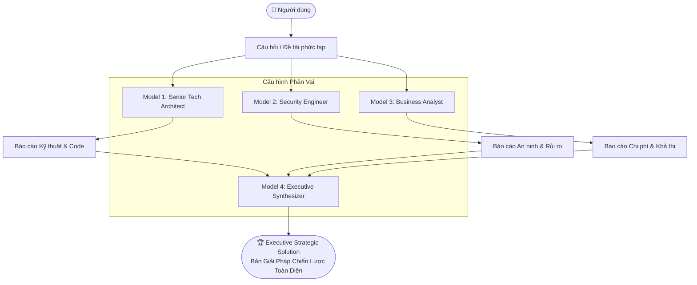
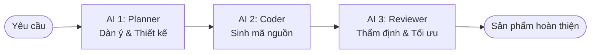

# Phase 9: Multi-Persona Role Assignment & Sequential Pipeline

## 1. Mục tiêu (Objective)

Nâng cấp hệ thống AI Orchestrator từ cơ chế phân phối câu hỏi đồng đều sang cơ chế **Chuyên Môn Hóa & Phân Vai Tinh Vi (Role-based Specialization)**:
1. **Tùy biến Cấu hình Phân vai (Custom Role Mapping)**:
   - Cho phép người dùng chủ động chọn AI nào làm việc gì: AI nào đóng vai trò tham mưu (Workers), AI nào giữ vai trò Trọng tài / Thẩm định (Synthesizer/Judge).
2. **Hội đồng Chuyên gia Đa Góc Nhìn (Council of Experts / Multi-Persona)**:
   - Phân chia câu hỏi lớn thành các góc nhìn chuyên môn sâu sắc:
     - 🛠️ **Senior Technical Architect**: Đi sâu vào kiến trúc, mã nguồn, hiệu năng, khả năng mở rộng.
     - 🛡️ **Cybersecurity Specialist**: Soi xét lỗ hổng bảo mật, nguy cơ dữ liệu, cơ chế xác thực.
     - 💼 **Product / Business Analyst**: Đánh giá chi phí vận hành, tính khả thi, giá trị doanh nghiệp.
     - 🧠 **Executive Synthesizer**: Gom cả 3 góc nhìn thành một bản Kế hoạch / Giải pháp toàn diện tối ưu nhất.
3. **Dây chuyền Tuần tự (Sequential Pipeline Chain)**:
   - AI 1 lập dàn ý / thiết kế (Planner) ➔ AI 2 viết code / triển khai (Implementer) ➔ AI 3 thẩm định & tối ưu (Reviewer).

---

## 2. Kiến trúc Tổng thể (Architecture Diagram)



---

## 3. Thiết kế Cấu trúc Dữ liệu (Data Models)

### `RoleAssignment`
```python
@dataclass
class RoleAssignment:
    provider: str                      # 'groq', 'gemini', 'openai', 'anthropic'
    model: str                         # Model ID cụ thể
    role_name: str                     # Tên vai diễn (vd: 'Senior Tech Lead')
    system_prompt: str                 # Chỉ dẫn hành vi chuyên biệt cho vai diễn
```

### `PersonaTemplate`
Các mẫu phân vai dựng sẵn (Built-in Personas):
- **Technical Lead**: *Tập trung giải pháp kỹ thuật, cấu trúc mã nguồn sạch, hiệu năng cao.*
- **Security Specialist**: *Tập trung phát hiện lỗ hổng, rủi ro bảo mật, tấn công tiềm tàng.*
- **Business Analyst**: *Tập trung bài toán chi phí, thời gian triển khai, ROI và giá trị sử dụng.*
- **Devil's Advocate (Phản Biện)**: *Tìm kiếm các lỗi logic, điểm yếu chết người trong giải pháp.*

---

## 4. Dây chuyền Tuần tự (Sequential Pipeline Chain)



- **Bước 1**: Nhận yêu cầu và giao cho AI lập dàn ý kiến trúc.
- **Bước 2**: Lấy dàn ý đưa tiếp cho AI triển khai chi tiết mã nguồn.
- **Bước 3**: Lấy mã nguồn đưa cho AI thứ 3 review, bắt lỗi và tối ưu hiệu năng.

---

## 5. Trải nghiệm Người Dùng (CLI UX Flow)

Menu lựa chọn trong Orchestrator:
```text
===========================================================================
  🎭 MULTI-MODEL ROLE ASSIGNMENT & SYNTHESIS
===========================================================================
  1. 🏛️ Hội đồng Chuyên gia (Council of Experts: Tech + Security + Business)
  2. ⚙️ Tùy chọn cấu hình (Tự chỉ định con nào làm việc gì & con nào tổng hợp)
  3. ⛓️ Dây chuyền Tuần tự (Planner ➔ Coder ➔ Reviewer)
  0. Quay lại
===========================================================================
```
